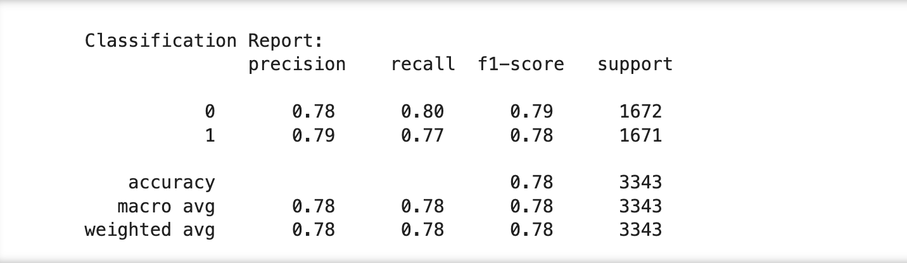
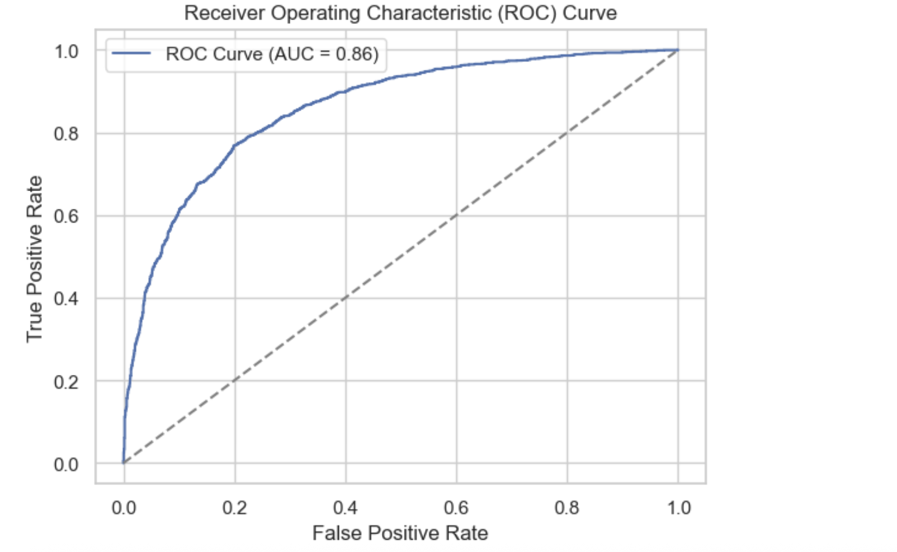
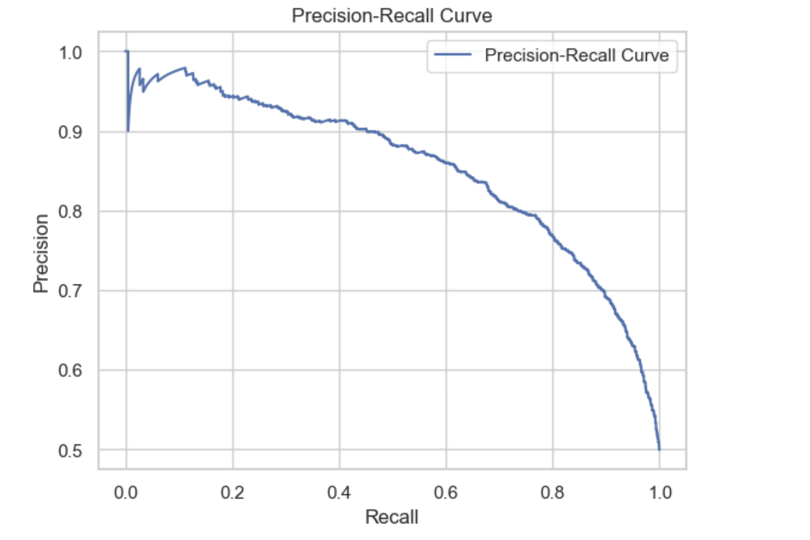
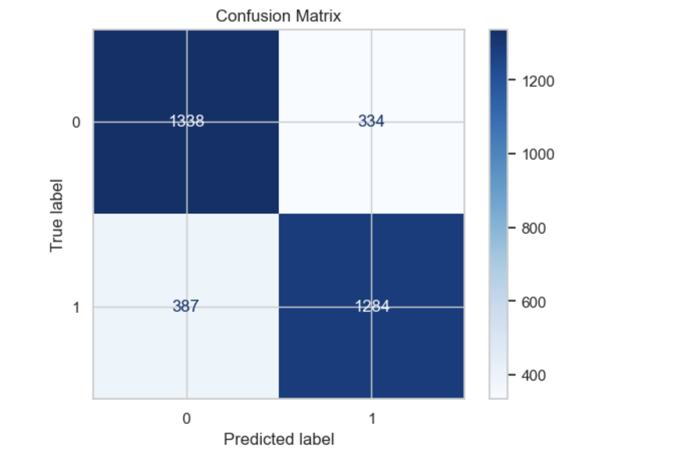

# Credit Risk Assessment with Neural Networks 

This project uses a neural network to assess credit risk based on historical loan data. The goal is to classify whether a loan application is high or low risk using various financial and demographic input features.

---

## 🧠 Model: Neural Network

A simple feed-forward neural network was implemented using Python to train on the dataset and make binary predictions. The model includes:

- Input normalization
- Dense layers with activation functions
- Binary classification output
- Loss and accuracy tracking over epochs

---

## 📊 Dataset

The dataset includes customer information such as:
- Credit history
- Income level
- Loan amount
- Employment status
- Past defaults, etc.

*Note:* This dataset may have been sourced from public repositories such as Kaggle or UCI.

---

## 🛠️ Tools & Libraries

- Python
- NumPy
- Pandas
- Matplotlib
- Jupyter Notebook

---
## 📈 Output Visualizations

**Classification Report**  

**ROC Curve**  

**Recall Curve**  

**Confusion Matrix**  

